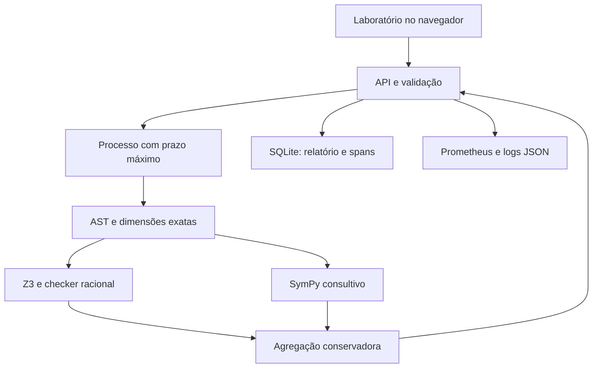

# Arquitetura da primeira entrega

## Decisão de escopo

Uma fatia vertical utilizável localmente, sem dependência de fornecedor de cloud ou LLM. O frontend usa recursos nativos do navegador para reduzir instalação e manter dados na mesma origem. A API separa contrato, compilador, oráculos, executor, armazenamento e telemetria.

## Fronteiras

| Módulo | Responsabilidade | Evolução possível |
| --- | --- | --- |
| `models.py`, `dsl.py` | Schema e AST restritos, dimensões em ℚ⁷ | Versões de DSL, unidades naturais, formalização revisada |
| `oracles.py` | Encoding Z3, checker racional e SymPy consultivo | Adaptadores Lean e Arb, certificados independentes |
| `engine.py` | Compilar, checar premissas, despachar, agregar | Política com custos; RL somente após baseline rotulado |
| `worker.py` | Isolamento de processo e timeout de parede | Fila e workers em contêineres separados |
| `storage.py` | Persistência SQLite e paginação | Repositório PostgreSQL, migrações e objetos de evidência |
| `api.py` | HTTP, limite de corpo, capacidade e correlação | Autenticação, autorização, idempotência e jobs |
| `telemetry.py` | Métricas de baixa cardinalidade e logs | OpenTelemetry/OTLP e tracing distribuído |
| `static/` | Edição, evidências, histórico, visão operacional | Editor estruturado e revisão humana da tradução |

## Confiabilidade computacional

- Limites de tamanho, profundidade e número de nós antes do solver.
- Sem avaliação de código da entrada ou carregamento de modelos externos.
- Todo o lote é compilado antes de qualquer consulta simbólica.
- Premissas inconsistentes nunca geram certificado vacuamente verdadeiro.
- Guardas de domínio preservadas a partir da AST, antes de simplificações.
- Testemunhas racionais reavaliadas sem usar o resultado simplificado do Z3.
- Processo descartável recebe orçamento de parede; encerra em timeout. Limites de memória/CPU são fornecidos pelo Compose; na execução nativa não há quota de memória por worker.
- Se o processo falha ou excede o prazo, o resultado é abstenção e não se fabricam evidências parciais.
- A semântica da política é uma baseline determinística. Não há treinamento, crença POMDP, probabilidade calibrada ou garantia empírica de FPR.

## Dados e concorrência

Cada execução concluída é gravada atomicamente com o JSON completo. IDs únicos identificam execuções, rastros e requisições; SHA-256 identifica a submissão normalizada. O hash não inclui versões: estas são campos separados do relatório. SQLite WAL permite leitura do histórico enquanto há gravações. O schema inicial é versão 1; evolução exige migrações explícitas.

Rode **um processo Uvicorn**: o limite de concorrência e os contadores são por processo. Dois workers descartáveis por padrão; a terceira submissão simultânea recebe 429. Jobs são gravados como `queued` antes do cálculo. Após reinício, registros `queued`/`running` são classificados como falha operacional. Cancelamento solicita o término do worker. Não prometemos exactly-once.

## Contrato científico e ajustes da especificação

A especificação fornecida é um programa de pesquisa, não evidência de implementação ou teoremas já demonstrados. Esta entrega evita transportar afirmações fortes sem justificativa:

1. Verificação de uma formalização não prova, por si, fidelidade ao texto. A revisão humana e o benchmark de tradução devem ser independentes.
2. Nem todo resultado de CAS tem a garantia de um kernel formal. Nesta versão, SymPy só produz evidência consultiva.
3. Restringir a um vocabulário de funções não demonstra que toda entrada pertença a um corpo de Hardy apropriado, que os domínios sejam válidos ou que exista um procedimento completo dentro do orçamento. Esses pontos exigem hipóteses e provas separadas.
4. `Refines(F,x)` deve ser tratado como condição de transferência de significado, não como uma equivalência geral necessária e suficiente entre a verdade de duas representações.
5. Contagens operacionais não medem risco, calibração ou falsos aceites. Os benchmarks descritos ainda precisam ser construídos, anotados e avaliados.

## Referências de implementação

- [Documentação oficial de parsing do SymPy](https://docs.sympy.org/latest/modules/parsing.html): alerta que `parse_expr` utiliza `eval`; por isso a implementação constrói objetos a partir de AST permitida.
- [Guia oficial de aritmética do Z3](https://microsoft.github.io/z3guide/docs/theories/Arithmetic/): fundamento para a fronteira de aritmética real e para tratar resultados desconhecidos explicitamente.
- [Repositório oficial do Z3](https://github.com/Z3Prover/z3): solver externo que integra a base de confiança desta versão.
