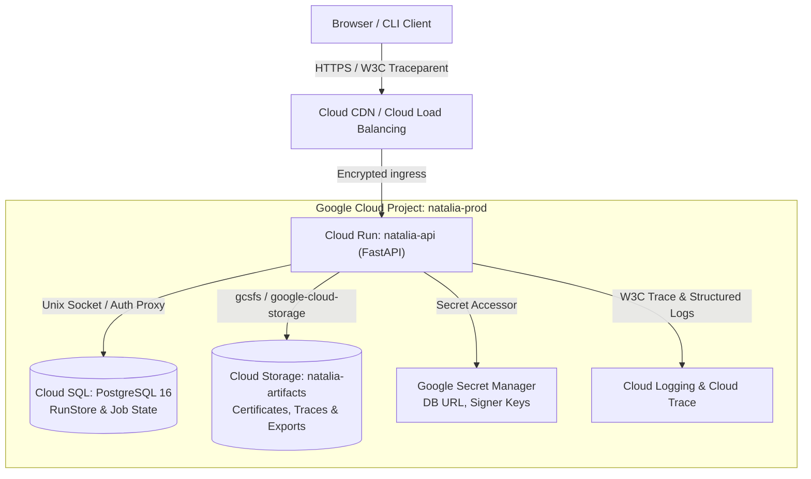

# Google Cloud Platform (GCP) Readiness Guide & Architecture Decision Record

**Project**: NatalIA — Scientific & Mathematical Verification Platform  
**Document Status**: Approved / Ready for Staging Migration  
**Target Environment**: Google Cloud Platform (GCP)  
**Schema Compatibility**: Protocol v4 / OpenAPI 3.1  

---

## 1. Executive Summary & Architecture Decision (ADR-001)

NatalIA's core mission is to provide an inspectable, deterministic, and evidence-backed physical-mathematical verification workbench. While local execution relies on SQLite, in-memory job queues, and isolated solver subprocesses (Z3, dReal, SymPy), scaling to multi-tenant or team research environments requires a cloud-native, reliable, and cost-efficient infrastructure.

### Architectural Decision

We adopt a **Serverless Container & Managed State** pattern on Google Cloud Platform:
- **Compute Layer**: **Google Cloud Run (fully managed)**. Containerized web application running the FastAPI API and frontend static assets. Scales to zero when idle, minimizing costs, while seamlessly auto-scaling during heavy verification runs.
- **Relational Persistence**: **Cloud SQL for PostgreSQL 16**. Replaces local SQLite for multi-instance persistence, ACID compliance, and concurrency control.
- **Verification Artifact Storage**: **Google Cloud Storage (GCS)**. Long-term object storage for serialized kernel certificates, SMT-LIB witness logs, exported verification bundles, and Lean 4 proof skeletons.
- **Secret & Config Management**: **Google Secret Manager**. Centralized, encrypted secret storage (database credentials, signing keys).
- **Asynchronous Workloads (Phased)**: Single-instance in-memory workers for Phase 1; **Google Cloud Tasks** + dedicated Cloud Run Worker services for Phase 2 distributed jobs.
- **Security & IAM**: Workload Identity Federation, non-root container user execution, least-privilege service accounts, and Content Security Policy (CSP).

---

## 2. High-Level Architecture



---

## 3. Storage Abstraction & Migration (SQLite to PostgreSQL)

### Current Architecture (`natalia/storage.py`)
NatalIA currently uses an SQLite WAL database encapsulated within the `RunStore` class. It manages runs, obligations, spans, and jobs with transactional safety.

### Cloud Target: PostgreSQL Adapter
To run on Cloud SQL without altering API behavior or contract tests, we implement a pluggable storage interface:

```python
from typing import Protocol, Optional, Dict, Any, List

class RunStoreProtocol(Protocol):
    def save(self, run: Dict[str, Any]) -> None: ...
    def get(self, run_id: str) -> Optional[Dict[str, Any]]: ...
    def list(self, limit: int = 50, offset: int = 0) -> Dict[str, Any]: ...
    def enqueue_job(self, submission: Dict[str, Any]) -> str: ...
    def get_job(self, job_id: str) -> Optional[Dict[str, Any]]: ...
```

#### PostgreSQL Schema (`migrations/001_initial_schema.sql`)
```sql
CREATE TABLE IF NOT EXISTS runs (
    id UUID PRIMARY KEY,
    trace_id VARCHAR(64) NOT NULL,
    request_id VARCHAR(64) NOT NULL,
    title TEXT NOT NULL,
    verdict VARCHAR(32) NOT NULL,
    guarantee_level VARCHAR(64) NOT NULL,
    job_status VARCHAR(32) NOT NULL,
    duration_ms DOUBLE PRECISION NOT NULL,
    input_sha256 VARCHAR(64) NOT NULL,
    created_at TIMESTAMP WITH TIME ZONE DEFAULT CURRENT_TIMESTAMP,
    document JSONB NOT NULL
);

CREATE INDEX idx_runs_created_at ON runs (created_at DESC);
CREATE INDEX idx_runs_input_sha256 ON runs (input_sha256);

CREATE TABLE IF NOT EXISTS jobs (
    id UUID PRIMARY KEY,
    status VARCHAR(32) NOT NULL,
    submission JSONB NOT NULL,
    run_id UUID REFERENCES runs(id),
    error TEXT,
    created_at TIMESTAMP WITH TIME ZONE DEFAULT CURRENT_TIMESTAMP,
    updated_at TIMESTAMP WITH TIME ZONE DEFAULT CURRENT_TIMESTAMP
);

CREATE INDEX idx_jobs_status ON jobs (status, created_at);
```

---

## 4. Containerization & Production Dockerfile

NatalIA requires Python 3.11+, Z3 SMT solver, and SymPy. The production container uses a minimal Debian base with a non-root user.

```dockerfile
# syntax=docker/dockerfile:1.4
FROM python:3.11-slim-bookworm AS builder

WORKDIR /build
RUN apt-get update && apt-get install -y --no-install-recommends \
    build-essential \
    && rm -rf /var/lib/apt/lists/*

COPY requirements.lock ./
RUN pip install --no-cache-dir --user -r requirements.lock

# Production Runtime Stage
FROM python:3.11-slim-bookworm AS runtime

ENV PYTHONUNBUFFERED=1 \
    PYTHONUTF8=1 \
    PATH="/home/natalia/.local/bin:$PATH" \
    PORT=8080

RUN apt-get update && apt-get install -y --no-install-recommends \
    ca-certificates \
    curl \
    && rm -rf /var/lib/apt/lists/*

# Run as non-root user for principle of least privilege
RUN groupadd -g 10001 natalia && \
    useradd -u 10001 -g natalia -m -s /bin/bash natalia

WORKDIR /app
COPY --from=builder --chown=natalia:natalia /root/.local /home/natalia/.local
COPY --chown=natalia:natalia . .

USER natalia:natalia

# Health check using the native /health/ready endpoint
HEALTHCHECK --interval=15s --timeout=3s --start-period=5s --retries=3 \
  CMD curl -f http://localhost:${PORT}/health/ready || exit 1

EXPOSE 8080

ENTRYPOINT ["python", "-m", "uvicorn", "natalia.api:create_app", "--factory", "--host", "0.0.0.0", "--port", "8080"]
```

---

## 5. Deployment Commands & Infrastructure as Code (IaC)

### 5.1 Project Setup & APIs
```bash
export PROJECT_ID="natalia-verification-prod"
export REGION="us-central1"
export SERVICE_NAME="natalia-api"

# Enable required Google Cloud APIs
gcloud services enable \
    run.googleapis.com \
    sqladmin.googleapis.com \
    storage.googleapis.com \
    secretmanager.googleapis.com \
    cloudbuild.googleapis.com \
    artifactregistry.googleapis.com \
    --project="${PROJECT_ID}"
```

### 5.2 Artifact Registry & Container Build
```bash
# Create Artifact Registry docker repository
gcloud artifacts repositories create natalia-repo \
    --repository-format=docker \
    --location="${REGION}" \
    --description="NatalIA Docker images"

# Build and submit image via Cloud Build
gcloud builds submit --tag "${REGION}-docker.pkg.dev/${PROJECT_ID}/natalia-repo/api:latest"
```

### 5.3 Cloud SQL Provisioning
```bash
# Create Cloud SQL PostgreSQL instance (cost-efficient db-custom-2-7680 or db-f1-micro for staging)
gcloud sql instances create natalia-db \
    --database-version=POSTGRES_16 \
    --tier=db-custom-2-7680 \
    --region="${REGION}" \
    --storage-type=SSD \
    --storage-size=20GB \
    --storage-auto-increase \
    --backup-start-time="03:00" \
    --enable-point-in-time-recovery

# Create database and user
gcloud sql databases create nataliadb --instance=natalia-db
gcloud sql users create natalia_user --instance=natalia-db --password="<STRONG_GENERATED_PASSWORD>"
```

### 5.4 Google Cloud Storage Bucket for Evidence Artifacts
```bash
gsutil mb -p "${PROJECT_ID}" -c standard -l "${REGION}" -b on "gs://${PROJECT_ID}-artifacts/"
gsutil uniformbucketlevelaccess set on "gs://${PROJECT_ID}-artifacts/"
```

### 5.5 Cloud Run Service Deployment
```bash
# Dedicated Service Account with Least-Privilege IAM
gcloud iam service-accounts create natalia-run-sa \
    --display-name="NatalIA Cloud Run Runtime Service Account"

# Grant roles: Cloud SQL Client, Storage Object Admin (bucket-specific), Secret Accessor
gcloud projects add-iam-policy-binding "${PROJECT_ID}" \
    --member="serviceAccount:natalia-run-sa@${PROJECT_ID}.iam.gserviceaccount.com" \
    --role="roles/cloudsql.client"

# Deploy to Cloud Run
gcloud run deploy "${SERVICE_NAME}" \
    --image="${REGION}-docker.pkg.dev/${PROJECT_ID}/natalia-repo/api:latest" \
    --region="${REGION}" \
    --service-account="natalia-run-sa@${PROJECT_ID}.iam.gserviceaccount.com" \
    --add-cloudsql-instances="${PROJECT_ID}:${REGION}:natalia-db" \
    --set-env-vars="NATALIA_ENV=production,NATALIA_GCS_BUCKET=${PROJECT_ID}-artifacts" \
    --set-secrets="DATABASE_URL=natalia-db-conn:latest" \
    --min-instances=0 \
    --max-instances=10 \
    --cpu=2 \
    --memory=2Gi \
    --timeout=60s \
    --allow-unauthenticated
```

---

## 6. IAM Least-Privilege Role Matrix

| Resource | Service Account | Role Assigned | Purpose |
| :--- | :--- | :--- | :--- |
| **Cloud SQL** | `natalia-run-sa` | `roles/cloudsql.client` | Connect via Unix domain socket / Auth Proxy |
| **Cloud Storage** | `natalia-run-sa` | `roles/storage.objectAdmin` (on artifact bucket only) | Read and write certificate artifacts & exports |
| **Secret Manager** | `natalia-run-sa` | `roles/secretmanager.secretAccessor` (on specific secrets) | Access PostgreSQL credentials & HMAC keys |
| **Cloud Logging** | `natalia-run-sa` | `roles/logging.logWriter` | Stream structured JSON audit logs |
| **Cloud Trace** | `natalia-run-sa` | `roles/cloudtrace.agent` | Send W3C traceparent distributed traces |

---

## 7. Observability, Monitoring & Alerts

1. **Health Check Probes**:
   - Readiness (`/health/ready`): Checks solver availability (Z3), database connectivity, and schema version.
   - Liveness (`/health/live`): Checks process event loop responsiveness.
2. **OpenTelemetry / Prometheus Metrics**:
   - `natalia_runs_total{verdict="..."}`
   - `natalia_obligations_total{oracle="...",status="..."}`
   - `natalia_job_duration_seconds{status="..."}`
3. **Budget Guardrails**:
   - Cloud Billing Budget set to $30.00 / month with alert notifications at 50%, 80%, and 100%.
   - Cloud Run max instances capped at 10 to prevent unbounded autoscaling during unexpected traffic spikes.
